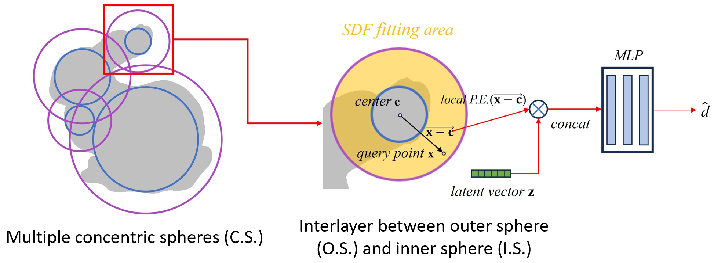
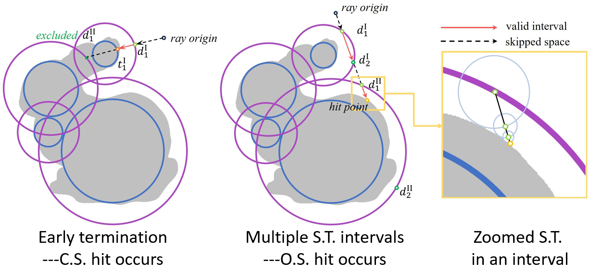

# Dual Spherical Shell (DSS)

This repository is the official implementation of our paper in IEEE International Conference on Multimedia and Expo (**ICME 2025**, oral presentation):

**Neural Implicit Reconstruction and Fast Rendering Based on Dual Spherical Shell**

__Authors:__ Zijian Wang, Yuqi Liu, Yan Zhao, Binghao Wang, Shen Cai*, Yanting Zhang.

**Links:**  [[Project Page]](http://www.cscvlab.com/research/DSS/) &nbsp; [[Video(bilibili)]](https://www.bilibili.com/video/BV17pdxYJEYM/) &nbsp; [[Video(Youtube)]](https://www.youtube.com/watch?v=oB-wbv7FWp8)

## Method

### Core idea in one sentence
Given a number of pre-computed concentric spheres, local SDF fitting within DSS is enabled, and early termination as well as parallel sphere tracing are facilitated for more efficient SDF rendering.

### Local SDF Fitting within DSS

<p align="center">
 
</p>

### Early Termination and Parallel Sphere Tracing (S.T.)

<p align="center">
 
</p>

### Advantages

1. **High-fidelity Reconstruction**: low reconstruction error, in terms of chamfer distance.
2. **Memory and Storage Efficiency**: small number of pre-computed geometric primitives.
3. **Rendering acceleration**: early termination and parallel sphere tracing (brings about 40% speed-up).
4. **NeuS improvement**: new sampling strategy; improvements in both accuracy and speed.

## Dataset
We use [Thingi10k](https://ten-thousand-models.appspot.com/) and [NeRF synthetic](https://drive.google.com/drive/folders/128yBriW1IG_3NJ5Rp7APSTZsJqdJdfc1) datasets, both of which are available from their official websites.

## Getting started
### Python dependencies
```
conda env create -f environment.yml
conda activate kaolin_test
pip install torch==1.8.0+cu111 torch-cluster==1.5.9 torch-geometric==1.4.1 torch-scatter==2.0.6 torch-sparse==0.6.10 torch-spline-conv==1.2.1

cd ./submodules/miniball
python setup.py install
cd ..
cd ./kaolin_sphere-0.9.1
python setup.py develop
cd ..
cd ./libigl/python
python setup.py
cd ..
cd ..
cd ./geolab-copy
cmake . -B build
cmake --build build 
```

### Training
```
python train.py
```
### Evaluation
```
python eval.py
python eval_ssim.py
```

## Third-Party Libraries

This code includes code derived from 3 third-party libraries:

- [NGLOD](https://github.com/nv-tlabs/nglod)  
- [ICML2021 (u2ni)](https://github.com/u2ni/ICML2021)  
- [Kaolin (NVIDIA GameWorks)](https://github.com/NVIDIAGameWorks/kaolin)  

## Citation

```bibtex
@inproceedings{Wang2025DSS,
  title={Neural Implicit Reconstruction and Fast Rendering Based on Dual Spherical Shell},
  author={Wang, Zijian and Liu, Yuqi and Zhao, Yan and Wang, Binghao and Cai, Shen and Zhang, Yanting},
  booktitle={IEEE International Conference on Multimedia and Expo (ICME)}, 
  year={2025},
}
```
