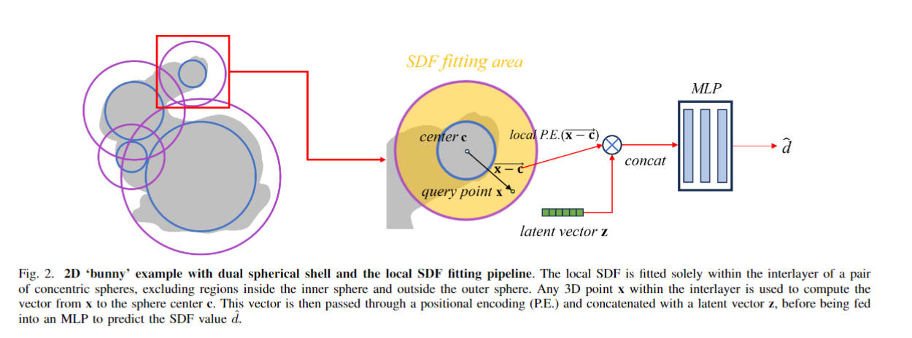
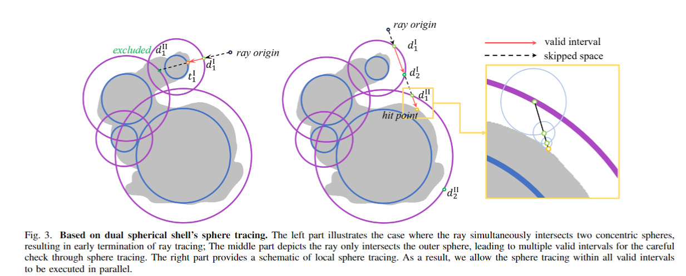
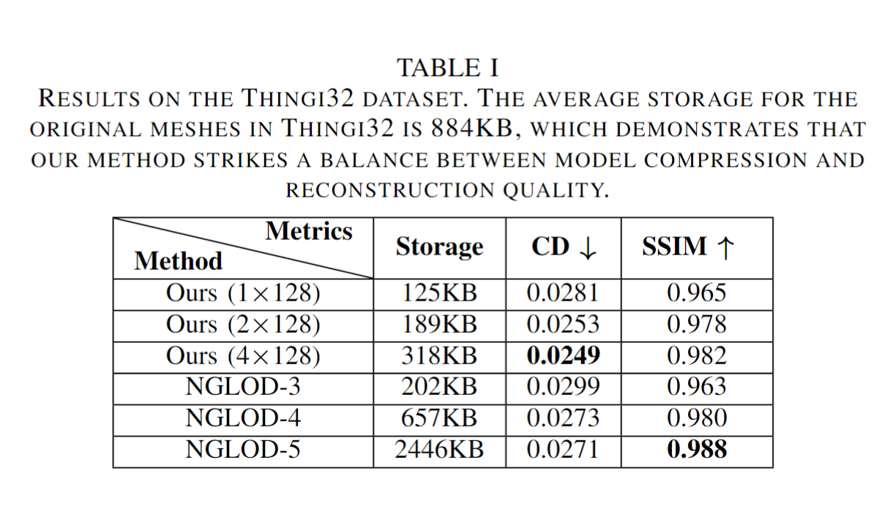
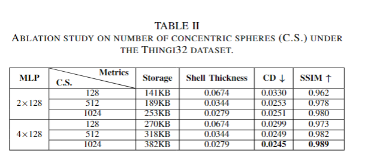
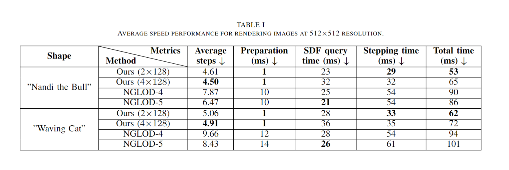
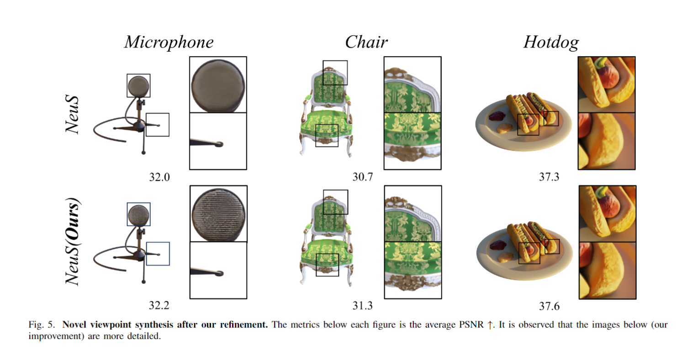
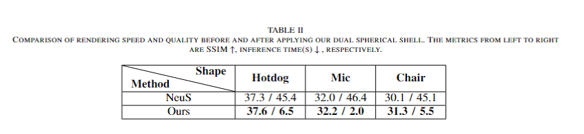

# Dual Spherical Shell (DSS)

This repository is the official implementation of our paper, accepted by IEEE International Conference on Multimedia and Expo (**ICME 2025**):

**Neural Implicit Reconstruction and Fast Rendering Based on Dual Spherical Shell**

__Authors:__ Zijian Wang, Yuqi Liu, Yan Zhao, Binghao Wang, Shen Cai*, Yanting Zhang.

**Links:**  [[Video(bilibili)]](https://www.bilibili.com/video/BV17pdxYJEYM/) [[Video(Youtube)]](https://www.youtube.com/watch?v=oB-wbv7FWp8)

## Method

### Core idea in one sentence
Given a number of pre-computed concentric spheres, local SDF fitting within DSS is enabled, and early termination as well as parallel sphere tracing are facilitated for more efficient SDF rendering.

### Local SDF Fitting within DSS

### Early Termination and Parallel Sphere Tracing (S.T.)


## Network
The dual spherical shell effectively constrains the upper and lower bounds of the SDF values, which helps to reduce the fitting difficulty. We assign an implicit vector to each sphere center to participate in the fitting, as shown in the figure below. The 3D vector between the fitting point and the sphere center is position-encoded and then concatenated with the implicit vector associated with the sphere center. This concatenated input is fed into an MLP, which ultimately outputs the predicted SDF value.


## Rendering
As shown in the figure below, during rendering, we utilize the dual spherical shell to eliminate unnecessary sphere tracing components and also exclude spaces that are not enclosed by the spherical shell.


## Experiment






## Dataset
We use Thingi10k and NeRF synthetic datasets, both of which are available from their official website.
### Thingi10k
You can download them at https://ten-thousand-models.appspot.com/
### NeRF synthetic
https://drive.google.com/drive/folders/128yBriW1IG_3NJ5Rp7APSTZsJqdJdfc1

## Getting started
### Python dependencies
```
conda env create -f environment.yml
conda activate kaolin_test
pip install torch==1.8.0+cu111 torch-cluster==1.5.9 torch-geometric==1.4.1 torch-scatter==2.0.6 torch-sparse==0.6.10 torch-spline-conv==1.2.1

cd ./submodules/miniball
python setup.py install
cd ..
cd ./kaolin_sphere-0.9.1
python setup.py develop
cd ..
cd ./libigl/python
python setup.py
cd ..
cd ..
cd ./geolab-copy
cmake . -B build
cmake --build build 
```

### Training
```
python train.py
```
### Evaluation
```
python eval.py
python eval_ssim.py
```

## Third-Party Libraries

This code includes code derived from 3 third-party libraries

https://github.com/nv-tlabs/nglod <br>
https://github.com/u2ni/ICML2021 <br>
https://github.com/NVIDIAGameWorks/kaolin <br>

## License
This project is licensed under the terms of the LGPL License (see `LICENSE` for details).
